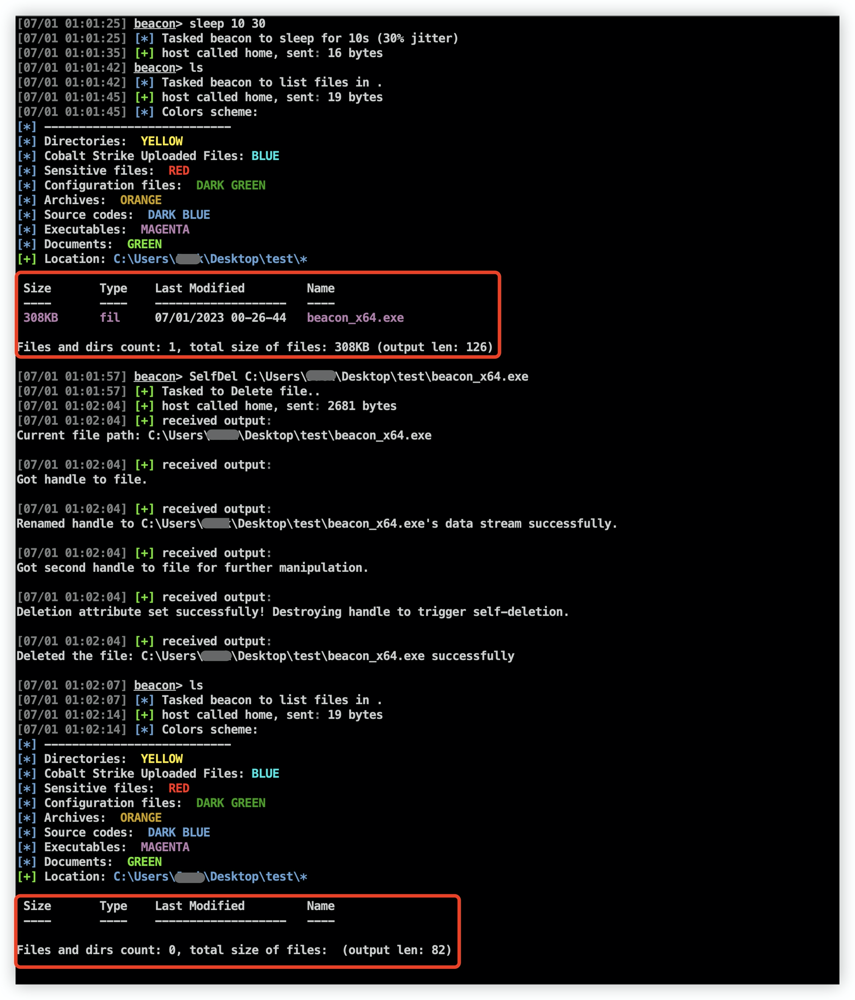

## SelfDel

使用beacon object file进行文件删除操作，主要是利用了SetFileInformationByHandle这个api。用于解决运行文件因为句柄占用无法删除问题，github很多自删除项目在白加黑时只能删除白文件。本项目主要改造了一下@EspressoCake的项目，去除掉了syscall操作以及增加自定义删除文件路径，支持64/32位beacon。

### usage

输入参数"self"或者指定要删除文件路径即可。

```
beacon> help SelfDel

Delete files regardless of handle occupation via SetFileInformationByHandle.

USAGE:
SelfDel <self / path to file>
```



### Reference

[GitHub - EspressoCake/Self_Deletion_BOF: BOF implementation of the research by @jonasLyk and the drafted PoC from @LloydLabs](https://github.com/EspressoCake/Self_Deletion_BOF)
